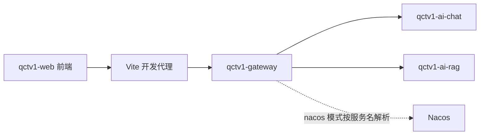
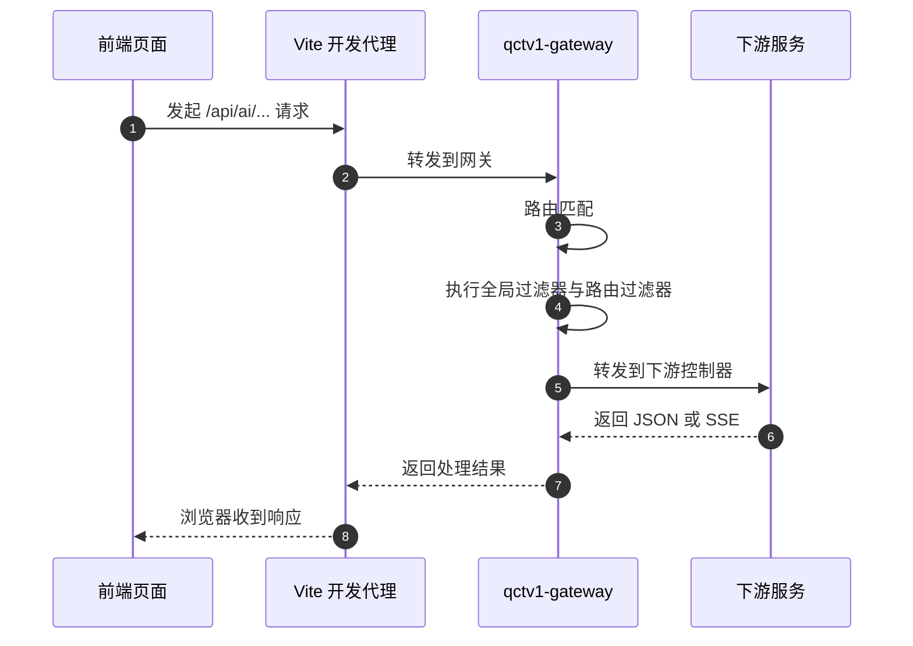
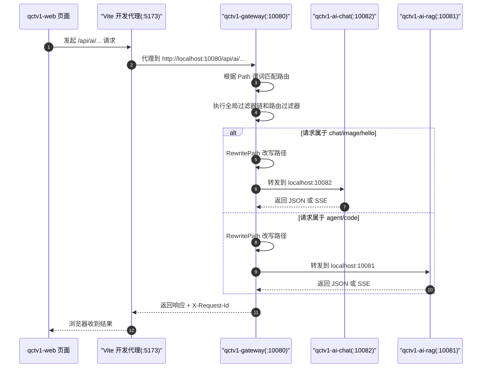
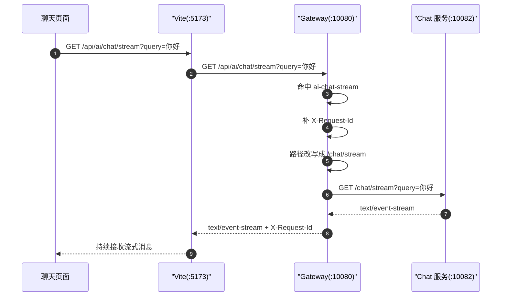
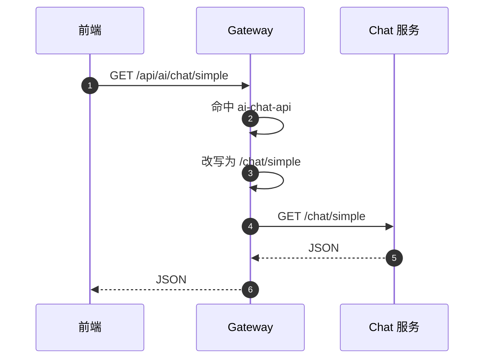
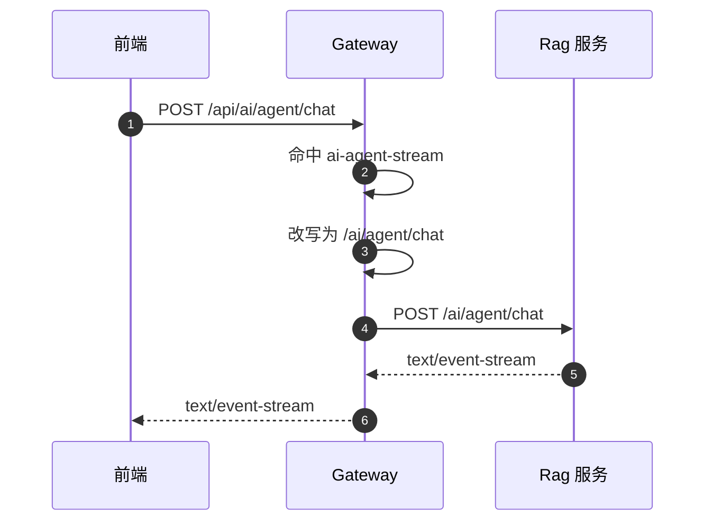
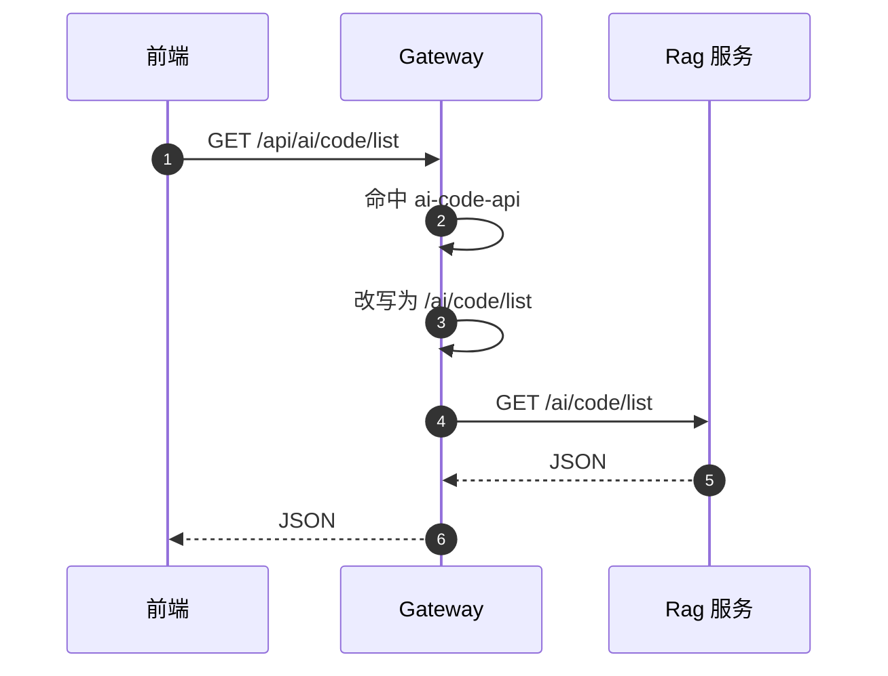
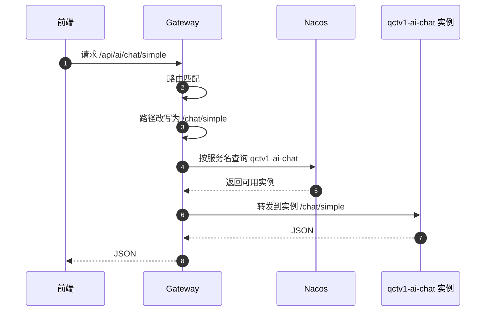

# qctv1 网关路由转发实现说明

本文档详细说明 `qctv1-gateway` 的路由转发实现过程，重点回答下面几个问题：

- 前端请求是如何进入网关的
- 网关如何判断请求应该转到哪个服务
- 网关如何把外部路径改写成下游控制器真实路径
- `local` 模式和 `nacos` 模式有什么区别
- 全局过滤器和路由过滤器分别在什么时候执行
- 出问题时应该从哪里开始排查

## 1. 文档目标

网关在这个项目里的核心职责，不是承载业务逻辑，而是把外部调用和内部服务结构解耦。

对前端来说：

- 只需要记住一套统一入口 `/api/ai/**`

对后端来说：

- 现有控制器路径可以继续保持原样
- 网关负责做路径翻译、服务选择和统一治理

## 2. 项目中的角色分工

### 2.1 前端

前端开发环境通过 `qctv1-web/vite.config.ts` 把 `/api` 开头的请求代理到网关。

也就是说，浏览器代码发出的通常是这种路径：

```text
/api/ai/chat/simple
/api/ai/chat/stream
/api/ai/agent/chat
/api/ai/code/list
```

前端不直接关心：

- `qctv1-ai-chat` 监听哪个端口
- `qctv1-ai-rag` 监听哪个端口
- 下游控制器真实路径到底是 `/chat/**` 还是 `/ai/agent/**`

### 2.2 网关

网关负责：

- 统一接住 `/api/ai/**`
- 根据路径前缀决定目标服务
- 使用 `RewritePath` 做路径翻译
- 执行请求 ID、日志、鉴权、CORS、重试、熔断等治理逻辑

核心实现文件：

- `src/main/java/com/qctv1/gateway/config/GatewayRouteConfig.java`
- `src/main/java/com/qctv1/gateway/filter/RequestIdGlobalFilter.java`
- `src/main/java/com/qctv1/gateway/filter/AccessLogGlobalFilter.java`
- `src/main/java/com/qctv1/gateway/filter/AuthenticationGlobalFilter.java`
- `src/main/java/com/qctv1/gateway/filter/CorsPreflightWebFilter.java`

### 2.3 下游服务

当前下游服务有两个：

- `qctv1-ai-chat`
- `qctv1-ai-rag`

它们已有的控制器路径大致是：

| 服务 | 控制器根路径 | 说明 |
| --- | --- | --- |
| `qctv1-ai-chat` | `/chat/**` | 聊天相关接口 |
| `qctv1-ai-chat` | `/image/**` | 图片相关接口 |
| `qctv1-ai-chat` | `/hello/**` | hello / demo 接口 |
| `qctv1-ai-rag` | `/ai/agent/**` | Agent 相关接口 |
| `qctv1-ai-rag` | `/ai/code/**` | 代码检索 / 代码片段接口 |

## 3. 整体结构

### 3.1 逻辑结构图



### 3.2 一句话理解

可以把整条链路理解成一句话：

前端统一访问 `/api/ai/**`，网关负责挑服务、改路径、加治理能力，最后再把请求转发给真正处理业务的下游服务。

## 4. 对外路由总表

### 4.1 路由映射表

| 对外访问路径 | 目标服务 | 路径改写规则 | 下游最终路径 |
| --- | --- | --- | --- |
| `/api/ai/chat/stream` | `qctv1-ai-chat` | `/api/ai/chat/(?<segment>.*)` -> `/chat/${segment}` | `/chat/stream` |
| `/api/ai/chat/**` | `qctv1-ai-chat` | `/api/ai/chat/?(?<segment>.*)` -> `/chat/${segment}` | `/chat/**` |
| `/api/ai/image/**` | `qctv1-ai-chat` | `/api/ai/image/?(?<segment>.*)` -> `/image/${segment}` | `/image/**` |
| `/api/ai/hello/**` | `qctv1-ai-chat` | `/api/ai/hello/?(?<segment>.*)` -> `/hello/${segment}` | `/hello/**` |
| `/api/ai/agent/chat` | `qctv1-ai-rag` | `/api/ai/agent/(?<segment>.*)` -> `/ai/agent/${segment}` | `/ai/agent/chat` |
| `/api/ai/agent/**` | `qctv1-ai-rag` | `/api/ai/agent/?(?<segment>.*)` -> `/ai/agent/${segment}` | `/ai/agent/**` |
| `/api/ai/code/**` | `qctv1-ai-rag` | `/api/ai/code/?(?<segment>.*)` -> `/ai/code/${segment}` | `/ai/code/**` |

### 4.2 为什么要显式改写路径

因为前端需要的是统一入口，而下游已经有各自独立的控制器结构。

例如：

- 前端更适合请求 `/api/ai/chat/simple`
- 但 `chat` 服务现有控制器真正接收的是 `/chat/simple`

这时就需要网关把“对外路径”和“对内路径”隔开。

这样做的好处是：

- 前端路径设计稳定
- 下游服务不用为了前端去重写控制器路径
- 后续新增模块时，仍然可以继续挂在 `/api/ai/**` 命名空间下

## 5. 转发目标是怎么确定的

### 5.1 local 模式

默认就是 `local` 模式。

配置来源：

- `src/main/resources/application.yml`
- `src/main/resources/application-local.yml`

此时生效的是固定地址：

```text
chat-uri = http://localhost:10082
rag-uri  = http://localhost:10081
```

所以网关不会去查注册中心，而是直接把请求发到本机端口。

### 5.2 nacos 模式

启用 `nacos` profile 后：

- 读取 `src/main/resources/application-nacos.yml`
- 加载 `spring.config.import=nacos:...`
- 下游目标切换为 `lb://qctv1-ai-chat` 和 `lb://qctv1-ai-rag`

此时最后一跳不再是固定端口，而是：

1. 先由 `ReactiveLoadBalancerClientFilter` 识别 `lb://`
2. 再到 Nacos 根据服务名查实例
3. 最后选择一个可用实例转发请求

### 5.3 两种模式的共同点和差异

| 对比项 | local 模式 | nacos 模式 |
| --- | --- | --- |
| 路由匹配 | 一样 | 一样 |
| 路径改写 | 一样 | 一样 |
| 过滤器链 | 一样 | 一样 |
| 目标地址解析方式 | 固定 HTTP 地址 | `lb://` + Nacos 服务发现 |
| 适用场景 | 本地开发、快速联调 | 接近生产、服务注册发现 |

结论就是：

前半段逻辑完全一样，只有最后“如何找到下游实例”这一跳不同。

## 6. 一个请求是如何一步步流转的

### 6.1 总体时序图



### 6.2 逐步拆解

当浏览器发起一个请求时，链路会经历下面这些阶段：

1. 前端代码发起 `/api/ai/...` 请求
2. Vite 开发代理把这个请求转发给 `qctv1-gateway`
3. 网关先根据 `Path` 谓词选出命中的路由
4. 进入 `FilteringWebHandler` 执行全局过滤器和当前路由的 `GatewayFilter`
5. `RewritePath` 把外部路径改写成下游控制器真实路径
6. 如果是 `local` 模式，直接请求固定 HTTP 地址
7. 如果是 `nacos` 模式，先根据服务名查实例，再转发
8. 下游服务返回结果，网关把响应透回前端

## 7. 具体接口时序图

### 7.1 本地开发模式完整时序图



### 7.2 聊天流接口时序图



这条路由单独拆出来的关键原因是：

- SSE 是长连接输出
- 普通接口的重试机制不适合 SSE
- 一旦重试，可能导致重复推流、顺序错乱或者连接中断

### 7.3 普通聊天接口时序图



### 7.4 Agent 流式接口时序图



### 7.5 代码列表接口时序图



### 7.6 Nacos 模式时序图



## 8. 过滤器链到底在做什么

### 8.1 执行顺序示意图

```mermaid
flowchart LR
    A["请求进入网关"] --> B["CorsPreflightWebFilter"]
    B --> C["RoutePredicateHandlerMapping 选路由"]
    C --> D["FilteringWebHandler"]
    D --> E["RequestIdGlobalFilter"]
    E --> F["AccessLogGlobalFilter"]
    F --> G["AuthenticationGlobalFilter"]
    G --> H["路由级 GatewayFilter"]
    H --> I["local 直连 或 nacos 服务发现"]
    I --> J["下游服务响应返回"]
```



### 8.2 当前过滤器顺序

| 顺序 | 过滤器 | 作用 |
| --- | --- | --- |
| 最先处理预检 | `CorsPreflightWebFilter` | 提前处理浏览器 CORS 预检请求 |
| 全局最高优先级 | `RequestIdGlobalFilter` | 补齐并透传 `X-Request-Id` |
| 其后 | `AccessLogGlobalFilter` | 记录方法、路径、状态码、耗时 |
| 再后 | `AuthenticationGlobalFilter` | 鉴权开关、白名单、401/403 统一返回 |
| 路由级 | `RewritePath` / `Retry` / `CircuitBreaker` | 做路径翻译和治理能力 |

### 8.3 普通接口为什么可以重试

普通接口当前只对 GET 请求启用了重试，原因是：

- GET 通常是幂等的
- 网关侧常见的瞬时异常可以通过少量重试恢复
- 只对 `502 / 503 / 504` 这类典型网关状态码重试，风险相对可控

### 8.4 为什么流式接口不能重试

流式接口如果重试，常见风险包括：

- 重复向前端推送已经输出过的数据
- 打乱消息顺序
- 把本来还活着的流连接误判为失败后重建

因此当前项目对 SSE 路由只保留最小过滤链，不挂普通重试逻辑。

## 9. Spring Cloud Gateway 核心类在当前项目中的角色

| 核心类 / 工厂 | 作用 | 当前项目是否使用 | 当前项目中的体现 |
| --- | --- | --- | --- |
| `RouteDefinition` | 路由定义抽象 | 概念上使用 | Java DSL 最终也会转成路由定义语义 |
| `RouteLocator` | 运行时路由集合 | 是 | `GatewayRouteConfig` |
| `RouteDefinitionLocator` | 提供路由来源 | 部分 | 主要由框架管理，当前不走配置式装配 |
| `DiscoveryClientRouteDefinitionLocator` | 自动按服务生成路由 | 否 | 当前显式关闭，避免路径不可控 |
| `RoutePredicateHandlerMapping` | 匹配请求与路由 | 是 | 根据 `/api/ai/**` 进行选路 |
| `FilteringWebHandler` | 执行过滤器链 | 是 | 负责串起全局过滤器和路由过滤器 |
| `PathRoutePredicateFactory` | 基于路径匹配 | 是 | 当前所有路由都主要靠它分流 |
| `MethodRoutePredicateFactory` | 基于方法匹配 | 暂未单独启用 | 未来可以对特定接口做更细分控制 |
| `HeaderRoutePredicateFactory` | 基于请求头匹配 | 暂未使用 | 未来可做租户、渠道或灰度路由 |
| `QueryRoutePredicateFactory` | 基于查询参数匹配 | 暂未使用 | 未来可用于调试开关、灰度参数 |
| `RewritePathGatewayFilterFactory` | 路径改写 | 是 | 当前最核心的转发能力 |
| `StripPrefixGatewayFilterFactory` | 按段裁剪路径 | 否 | 当前不用它，原因是显式重写更清晰 |
| `RequestRateLimiterGatewayFilterFactory` | 限流 | 否 | 后续可按用户或接口维度扩展 |
| `RetryGatewayFilterFactory` | 重试 | 是 | 普通 GET 接口启用 |
| `CircuitBreakerGatewayFilterFactory` | 熔断 | 是 | 普通接口启用 |
| `TokenRelayGatewayFilterFactory` | OAuth2 token 透传 | 否 | 当前没有接入 OAuth2 |
| `ReactiveLoadBalancerClientFilter` | 处理 `lb://` 地址 | 是 | nacos 模式下负责服务发现寻址 |
| `ServerWebExchange` | 请求与响应上下文 | 是 | 所有过滤器都通过它读写数据 |
| `AbstractGatewayFilterFactory` | 自定义路由过滤器基类 | 否 | 当前暂未自定义路由工厂 |
| 自定义 `GlobalFilter` | 全局治理扩展点 | 是 | 请求 ID、日志、鉴权骨架 |

## 10. 前端请求为什么可以只记一套路径

这是网关设计的最大价值之一。

前端只需要记住：

- `/api/ai/chat/...`
- `/api/ai/image/...`
- `/api/ai/hello/...`
- `/api/ai/agent/...`
- `/api/ai/code/...`

而不需要关心：

- chat 服务监听哪个端口
- rag 服务监听哪个端口
- 目标接口在下游控制器上的真实路径是什么
- 未来下游服务是否扩容、迁移或切换到服务发现

这些差异全部由网关承担。

## 11. 如果后续要新增一条路由，应该怎么做

假设后续你要新增一个对外接口：

```text
/api/ai/embedding/**
```

而下游真实控制器路径是：

```text
/embedding/**
```

那么通常需要改这几处：

### 11.1 新增路由规则

在 `GatewayRouteConfig.java` 里增加一条路由，例如：

```java
.route("ai-embedding-api", route -> route
        .path("/api/ai/embedding/**")
        .filters(filter -> standardFilters(filter, properties, "embedding-api")
                .rewritePath("/api/ai/embedding/?(?<segment>.*)", "/embedding/${segment}"))
        .metadata(RouteMetadataUtils.CONNECT_TIMEOUT_ATTR, properties.getRoutes().getConnectTimeoutMs())
        .metadata(RouteMetadataUtils.RESPONSE_TIMEOUT_ATTR, properties.getRoutes().getResponseTimeoutMs())
        .uri(properties.getRoutes().getChatUri().toString()))
```

### 11.2 视情况补充熔断实例

如果这条路由需要单独的熔断实例名，就在 `application.yml` 的 `resilience4j.circuitbreaker.instances` 下增加配置。

### 11.3 更新文档

至少同步更新：

- `README.md`
- `ROUTING.md`

这样前端和后端联调时就不会靠口头记忆。

## 12. 观测与调试

### 12.1 看路由是否生效

优先检查：

```text
/actuator/gateway/routes
```

这个接口能回答两个核心问题：

- 你的路由有没有真正被装配进去
- 当前生效的谓词、过滤器、目标地址到底是什么

### 12.2 看服务是否可用

优先检查：

```text
/actuator/health
```

如果是 nacos 模式，还要同时看：

- Nacos 控制台里有没有 `qctv1-gateway`
- Nacos 控制台里有没有 `qctv1-ai-chat`
- Nacos 控制台里有没有 `qctv1-ai-rag`

### 12.3 看请求链路是否贯通

重点看：

- 前端请求路径是否真的是 `/api/ai/...`
- 网关日志里有没有对应的 `X-Request-Id`
- 下游服务日志里有没有相同的 `X-Request-Id`

如果三端都能串起来，定位问题会快很多。

## 13. 常见问题与排障思路

### 13.1 请求没有到达下游服务

按下面顺序查：

1. 浏览器最终发出的 URL 是否真的是 `/api/ai/...`
2. `qctv1-web` 的 Vite 代理是否指向网关端口
3. 网关是否成功启动
4. 当前请求是否命中了正确路由
5. 路径改写后是否真的对应到了下游控制器
6. local 模式下 `10081 / 10082` 是否已经监听
7. nacos 模式下下游服务是否已经注册到 Nacos

### 13.2 浏览器报 CORS 错误

重点检查：

- `CorsPreflightWebFilter.java`
- `Qctv1GatewayProperties.java`
- `application.yml`

重点确认：

- `Origin` 是否在允许列表中
- 是否是 `OPTIONS` 预检请求
- 是否返回了 `Access-Control-Allow-Origin`
- 是否暴露了前端需要读取的响应头

### 13.3 流式接口异常中断

重点确认：

- 是否命中了 SSE 专用路由
- 下游是否真的返回了 `text/event-stream`
- 前端是否按流式方式消费响应
- 是否误把流式接口走到了普通重试路由上

### 13.4 Nacos 模式下请求找不到实例

重点确认：

- 是否真的激活了 `nacos` profile
- `NACOS_SERVER_ADDR`、账号密码、命名空间、分组是否正确
- `qctv1-ai-chat` / `qctv1-ai-rag` 是否已经注册
- 服务名是否和网关配置里的 `lb://服务名` 完全一致

## 14. 后续可以扩展什么

当前版本已经把网关骨架搭好，后续可以平滑扩展这些能力：

- 真实 JWT / OAuth2 校验
- 用户维度或接口维度限流
- 黑白名单和 IP 控制
- 接口签名校验
- 灰度发布和金丝雀路由
- 网关层审计日志
- 更细粒度的路由级超时和熔断参数

## 15. 实现总结

路由转发功能的实现，本质上可以概括成一句话：

前端统一请求 `/api/ai/**`，网关按路径前缀挑选目标服务，并把外部路径改写成下游控制器实际路径，再由 local 直连或 Nacos 服务发现完成最终转发。

拆开来看就是：

1. 前端入口统一
2. 网关路由统一匹配
3. 网关统一做路径翻译
4. 网关统一加治理能力
5. 下游服务保持现有控制器结构不变

这套方式的优点是：

- 前端路径稳定
- 后端模块边界清晰
- 后续可以平滑切到 Nacos
- 更容易在网关层统一加鉴权、限流、审计和观测能力
